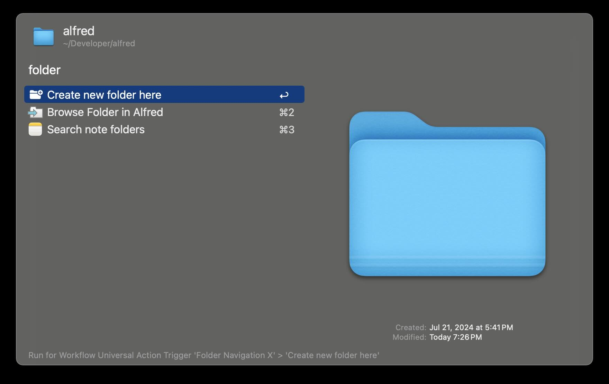
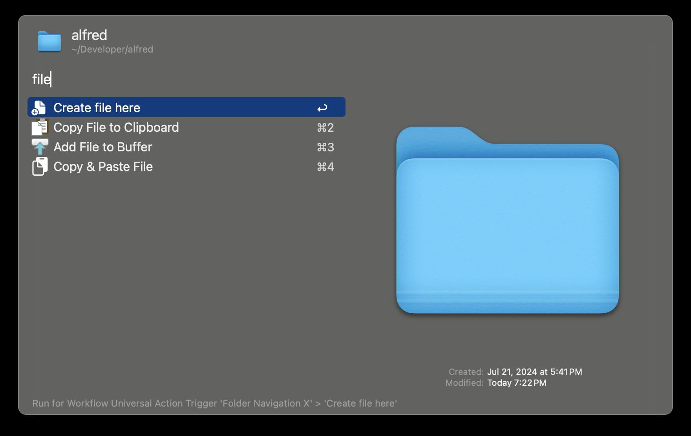
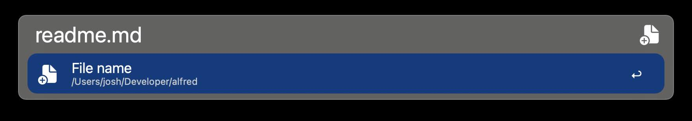
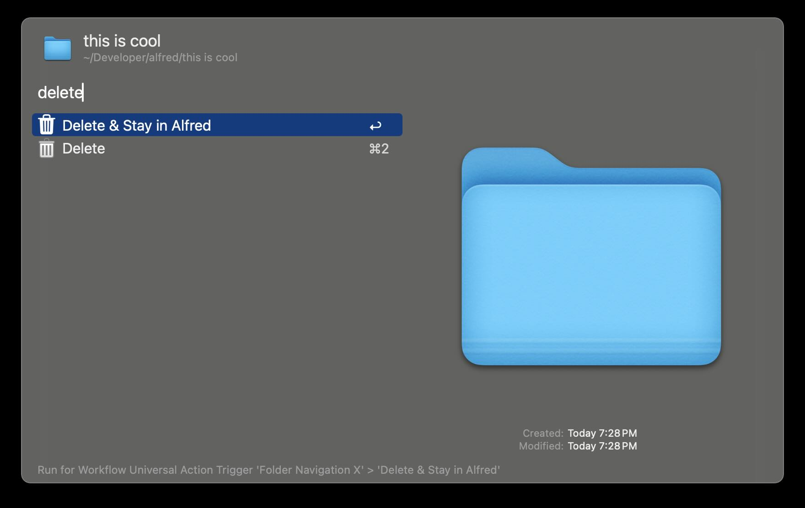
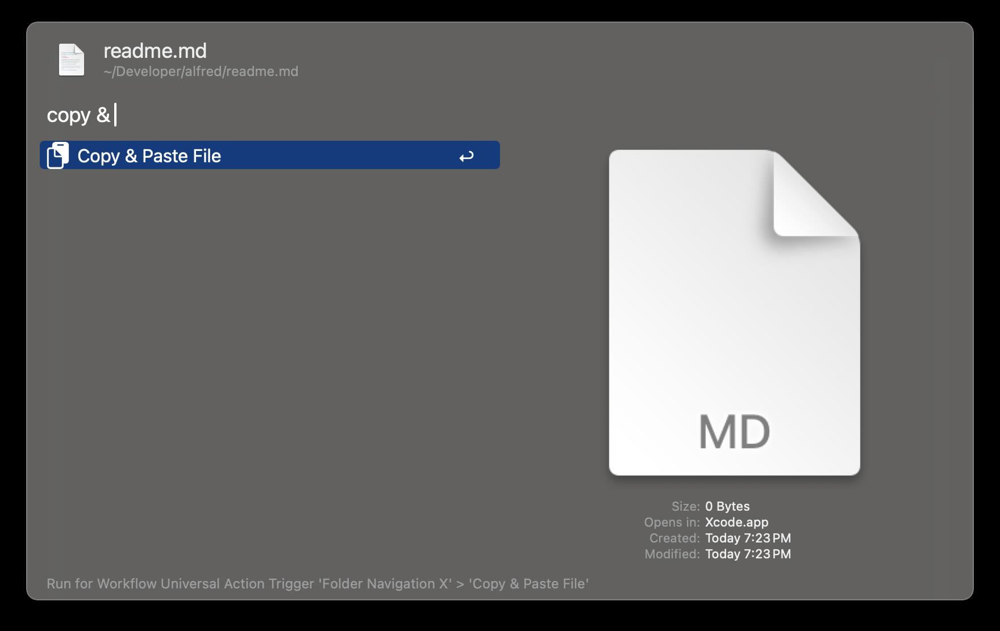

# Folder Navigation X

Adds helpful Universal Actions to the Folder Navigation

## Usage

### Create new folder here

### Create new file here

### Delete & Stay in Alfred

### Copy & Paste File

