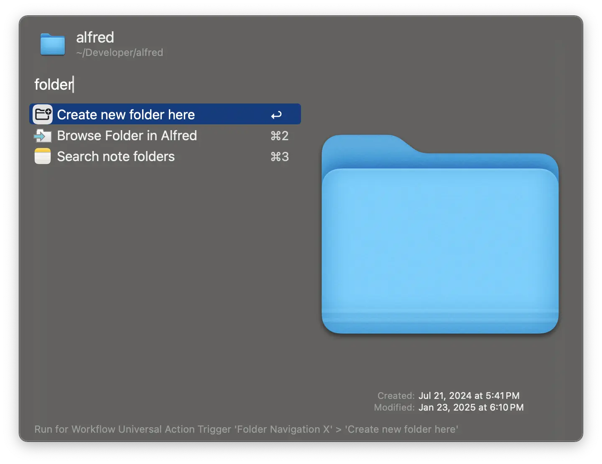
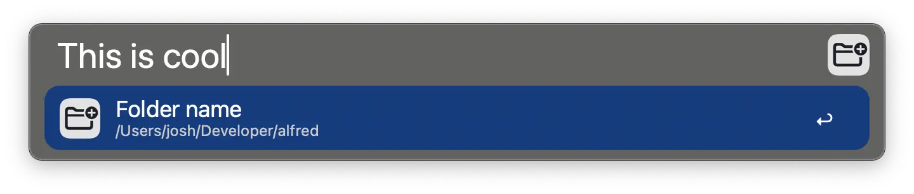
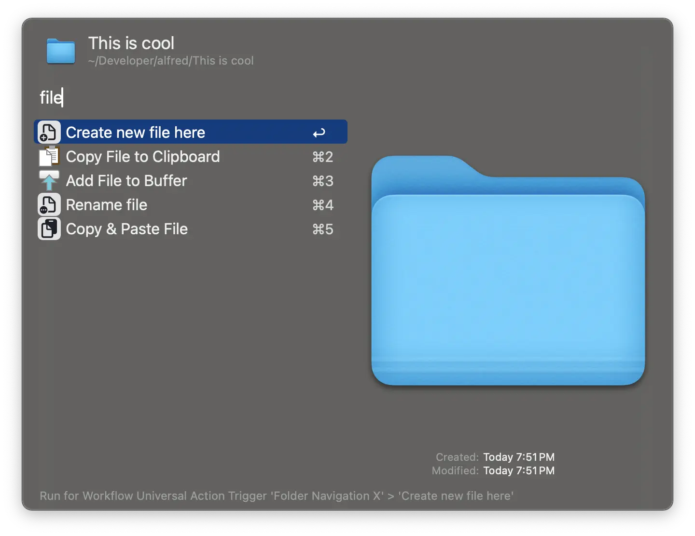
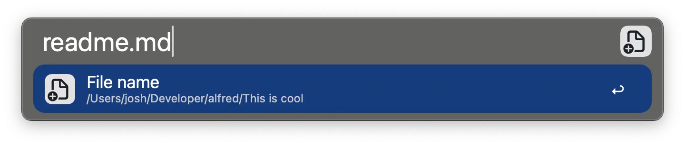
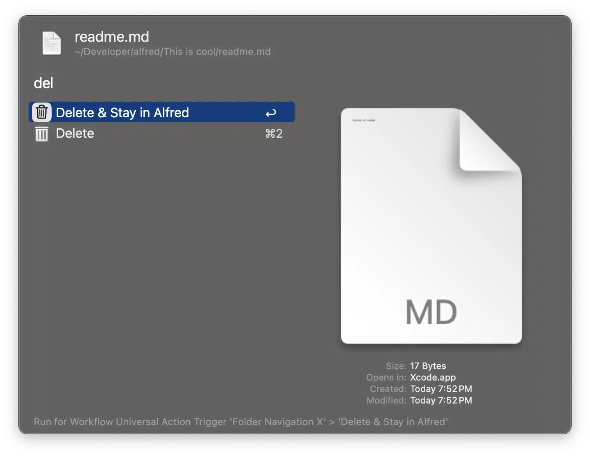
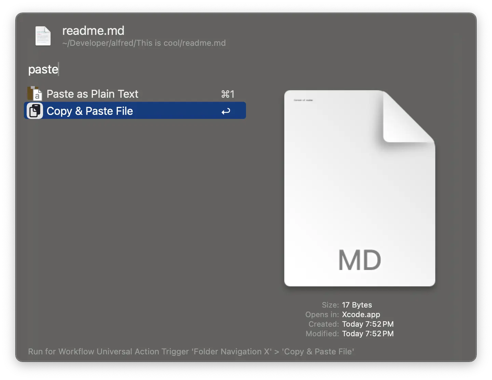
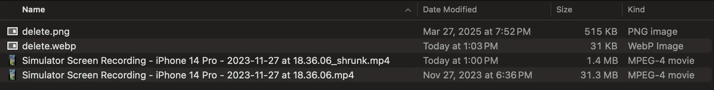

# Folder Navigation X

Adds helpful Universal Actions to the Folder Navigation

* **Create new folder here**
    * Based on if you run this action on a folder or on a file - allows you to create a folder in that folder or at the same level as the file 
* **Create new file here**
    * Based on if you run this action on a folder or on a file - allows you to create a file in that folder or at the same level as the file 
    * Allows you to type the the content of the file
* **Rename file**
* **Delete & Stay in Alfred**
* **Copy & Paste File**
    * Allows you to copy any file type (png, txt, pdf, zip, etc) to the clilpboard and paste in one action
* **Convert to webp**
    * Shrinks images to a much smaller size -> up to 95% smaller!
    * Converts any image to [webp](https://developers.google.com/speed/webp)
    * Dependency `cwebp` - installed via `brew install webp`
* **Shrink video**
    * Shrinks video to a much smaller size -> up to 95% smaller!
    * Perfect for shrinking screen recordings, simulator videos, and more
    * Dependency `ffmpeg` - installed via `brew install ffmpeg`  
* **Convert to gif**
    * Converts video to a gif
    * Dependency `ffmpeg` - installed via `brew install ffmpeg`  

---

## 🚀 Usage

### Create new folder here

### Create new file here

### Delete & Stay in Alfred

### Copy & Paste File

### Shrink Image & Videos

---

## 🛠️ Installation

1. Download [the latest workflow](https://github.com/jangelsb/folder-navigation-x-alfred-workflow/releases) and import it into Alfred
2. Press `⌘ + ⌥ + /` to launch File Navigation in Alfred
3. Press `→` on a file or folder to launch the Universal Actions
4. Search for commands
3. Enjoy & God bless 

---

## 📝 Version History

For full change log see: https://github.com/jangelsb/folder-navigation-x-alfred-workflow/releases

