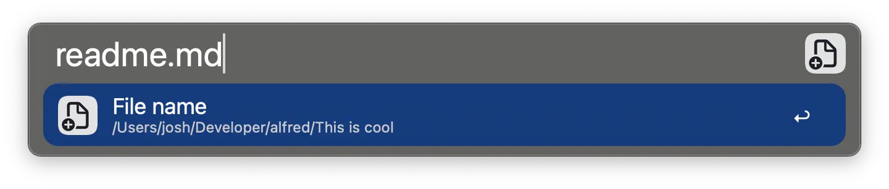

# Folder Navigation X

Adds helpful Universal Actions to the Folder Navigation

* **Create new folder here**
    * Based on if you run this action on a folder or on a file - allows you to create a folder in that folder or at the same level as the file 
* **Create new file here**
    * Based on if you run this action on a folder or on a file - allows you to create a file in that folder or at the same level as the file 
    * Allows you to type the the content of the file
* **Rename file**
* **Delete & Stay in Alfred**
* **Copy & Paste File**
    * Allows you to copy any file type (png, txt, pdf, zip, etc) to the clilpboard and paste in one action
* **Convert to webp**
    * Converts any image to [webp](https://developers.google.com/speed/webp)
    * Dependency `cwebp` - installed via `brew install webp`
* **Shrink video**
    * Shrinks video to a much smaller size -> up to 95% smaller (see screenshot below)!
    * Perfect for shrinking screen recordings, simulator videos, and more
    * Dependency `ffmpeg` - installed via `brew install ffmpeg`  

---

## 🚀 Usage

### Create new folder here

### Create new file here

### Delete & Stay in Alfred

### Copy & Paste File

### Shrink Videos

---

## 🛠️ Installation

1. Download [the latest workflow](https://github.com/jangelsb/folder-navigation-x-alfred-workflow/releases) and import it into Alfred
2. Press `⌘ + ⌥ + /` to launch File Navigation in Alfred
3. Press `→` on a file or folder to launch the Universal Actions
4. Search for commands
3. Enjoy & God bless 

---

## 📝 Change Log

#### v2025.2
* New action to convert images to webp!
    * Dependency `cwebp` - installed via `brew install webp`  
    * If `cwebp` is not installed - action will tell you to install it
* New action to shrink videos!
    * Dependency `ffmpeg` - installed via `brew install ffmpeg`  
    * If `ffmpeg` is not installed - action will tell you to install it

---

#### v2025.1
* Refreshed icons!
* Removed the copy file name to clipboard when renaming a file, as it was unnecessary and made pasting a new name impossible
* Fixed the Copy & Paste File action to now reliably paste the file - you can copy and paste any file type (e.g., pdfs, txt, zip, etc) 😎
* Updated create file action to use the new TextView instead of just touching the file - now you can give the text file content or not 
* Update create folder action to not navigate you back to the newly created folder but the parent folder - so you can easily do actions on the created folder (like make a new file, etc)

---

#### v2024.3
* Added support to rename files
* Added the word "touch" to the create new file action